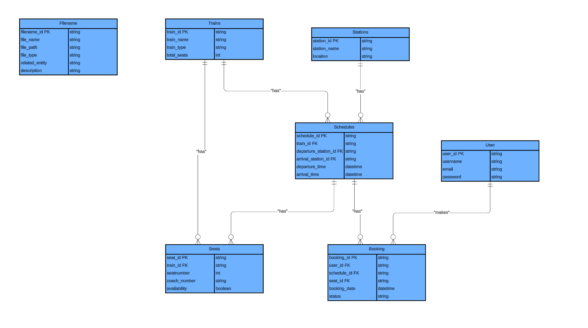

# 🚆 Online Railway Reservation System

## 📌 Project Overview
The Online Railway Reservation System is a relational database project designed to manage train schedules, seat availability, user bookings, and related metadata. Built using MySQL, the system applies rigorous normalization principles (1NF → 3NF) and models real-world relationships through a well-structured schema and entity-relationship diagram (ERD).

### 🧩 Entity-Relationship Diagram (ERD)
The diagram below illustrates the relationships between key entities in the railway reservation system, including trains, schedules, stations, seats, users, and bookings. It reflects a fully normalized structure with resolved transitive dependencies.



---

## 🧠 Key Features
- Train and station management  
- Schedule creation and route mapping  
- Seat tracking and availability status  
- User registration and booking functionality  
- Search operations by filename, train, and booking status  
- Fully normalized schema with transitive dependency resolution  
- Sample data and query operations included

---

## 🛠️ Technologies Used
- **MySQL** (SQL dialect)  
- **SQL DDL & DML**  
- **Normalization** (1NF, 2NF, 3NF)  
- **Entity-Relationship Modeling**  
- **Markdown Documentation**

---

## 📂 Repository Contents
```bash
online-railway-reservation-system/
├── README.md
├── Online Railway Reservation System.sql
├── erd_screenshot.png
```
---

## 🧪 How to Use
Clone this repository to your local machine.

Open Online Railway Reservation System.sql in MySQL Workbench or any compatible SQL environment.

Execute the schema creation and data insertion scripts.

Use the included queries to test search, booking, and update operations.

---

## 📦 Database Entities
Entity	Description
Filename	Metadata about system-related files
Trains	Train details including type and seat capacity
Stations	Station names and locations
Schedules	Train routes and timings
Seats	Seat availability and coach info
User	Registered users with login credentials
Booking	Reservation records linked to users, seats, and schedules
Schedule_Train	Resolves transitive dependency between booking and train 

---

## 📜 License
This project is licensed under the MIT License. You are free to use, modify, and distribute this work with proper attribution.

---

👤 Author
**Mustan**   
GitHub: [github.com/Mustan-dev](https://github.com/Mustan-dev)  


---

💬 Reflection
Designing this system deepened my understanding of database architecture, normalization, and real-world modeling. From literature review to ERD construction and SQL implementation, each phase reinforced the importance of structure, clarity, and scalability in system design. This project reflects both academic rigor and practical readiness for professional development work.