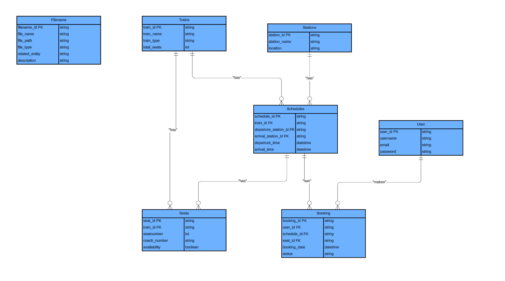
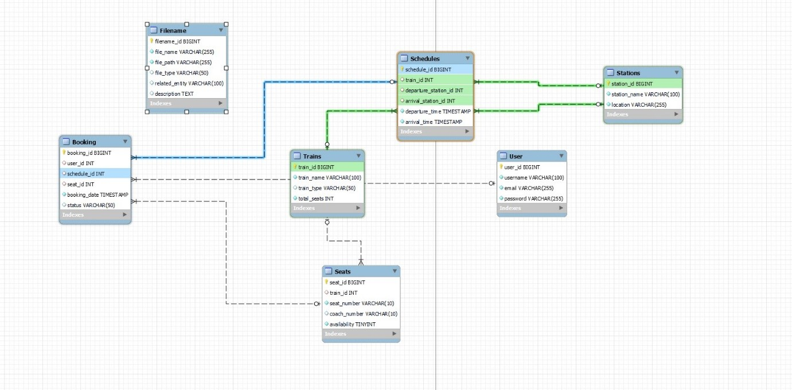
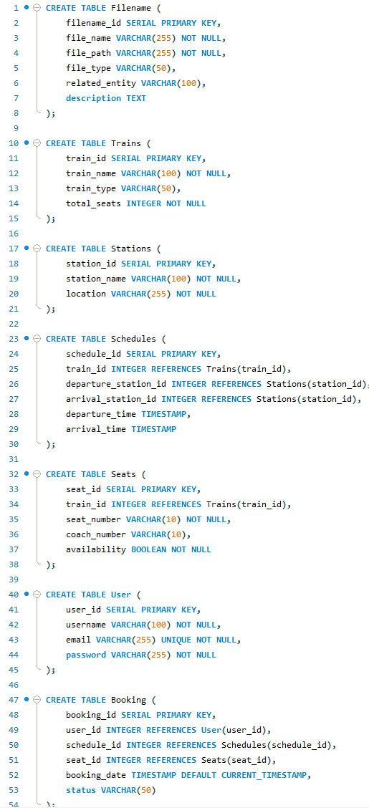

# 🚆 Online Railway Reservation System (ORRS)

## 📌 Overview

This project presents a fully normalized MySQL database system for managing train schedules, passenger bookings, seat availability, and associated metadata. Designed as part of the SWE4203 Databases module, the system reflects real-world railway operations and integrates modern infrastructure and security principles.

---

## 🖼️ System Visuals

### 1️⃣ ERD Diagram – Booking & Trait Relationships

This diagram illustrates the relationships between entities such as Filenames, Traits, Students, Schedules, Users, Seats, and Bookings. It shows how foreign keys connect the system and supports normalization and query efficiency.



---

### 2️⃣ ERD Diagram – Transportation Schema

This ERD represents the structure of a transportation booking system. It includes entities such as `Trains`, `Schedules`, `Stations`, `Users`, `Seats`, `Booking`, and `Release`, with clear foreign key relationships and timestamp tracking.



---

### 3️⃣ Network Diagram – Dual Site Deployment

This diagram illustrates the infrastructure connecting the London Data Center and Liverpool Office via VPN. It includes servers, firewalls, switches, and both wired and wireless client devices, showcasing secure and scalable deployment.


---

### 4️⃣ Network Topology – Full System Layout

This diagram presents a layered network architecture for the Online Railway Reservation System. It includes segmented server roles (Web, App, DB), firewalls, routers, and a client-side network with both wired and wireless devices. It also shows cloud integration for external access and scalability.


---

### 5️⃣ SQL Schema – Table Definitions

This screenshot shows the SQL table creation statements for the Online Railway Reservation System. It includes tables for trains, stations, schedules, seats, users, bookings, and file metadata, with appropriate data types, constraints, and foreign key relationships.



---

## 🧱 Features

- **Train Scheduling**: Define routes, departure/arrival times, and travel durations  
- **Seat Management**: Track seat availability, class, and assignment  
- **User Booking**: Enable passengers to reserve seats and view booking status  
- **File Metadata**: Store and retrieve documents related to trains, stations, and users  
- **Search & CRUD Operations**: Perform efficient queries and data manipulation  
- **Normalized Schema**: All tables conform to 3NF for data integrity and scalability  
- **Infrastructure Design**: Includes network topology and deployment architecture

---

## 🗂️ Database Schema

### Tables

| Table Name     | Description |
|----------------|-------------|
| `FileName`     | Metadata for system-related files (e.g., PDFs, maps) |
| `Trains`       | Train details including type and seat capacity |
| `Stations`     | Station names, codes, and city locations |
| `Schedules`    | Train routes with departure/arrival stations and times |
| `Seats`        | Seat numbers, class, and availability per train |
| `User`         | Passenger information and login credentials |
| `Booking`      | Reservation records linking users, seats, and schedules |
| `Schedule_Train` | Resolves transitive dependency between schedules and trains |

### Sample Schema Snippet

```sql
CREATE TABLE Trains (
  train_id SERIAL PRIMARY KEY,
  train_name VARCHAR(100) NOT NULL,
  train_type VARCHAR(50) NOT NULL,
  total_seats INTEGER NOT NULL
);

CREATE TABLE Booking (
  booking_id SERIAL PRIMARY KEY,
  user_id INTEGER REFERENCES User(user_id),
  schedule_id INTEGER REFERENCES Schedules(schedule_id),
  seat_id INTEGER REFERENCES Seats(seat_id),
  booking_date TIMESTAMP DEFAULT CURRENT_TIMESTAMP,
  status VARCHAR(50)
);
```
---

## 🔍 Sample Queries

Search Operations
```sql
-- Search by File Type
SELECT * FROM FileName WHERE file_type = 'Pdf';

-- Search for Available Seats
SELECT * FROM Seats WHERE train_id = 1 AND is_available = TRUE;

-- Search for User Bookings
SELECT * FROM Booking WHERE user_id = 2;
```
---

## Data Manipulation

```sql
-- Insert New Train
INSERT INTO Trains (train_name, train_type, total_seats)
VALUES ('Express A', 'Express', 200);

-- Update Booking Status
UPDATE Booking SET status = 'Cancelled' WHERE booking_id = 2;
```
---

## 🧠 Normalization Summary

All tables are normalized to Third Normal Form (3NF):

No repeating groups (1NF)

No partial dependencies (2NF)

No transitive dependencies (3NF)

A junction table Schedule_Train was introduced to resolve a transitive dependency between Booking → Schedule → Train.

---

## 🧭 Entity-Relationship Diagram (ERD)

The ERD illustrates relationships between core entities such as trains, schedules, stations, users, bookings, and seats. It includes:

One-to-many relationships (e.g., Trains → Seats)

Many-to-one relationships (e.g., Booking → User)

Foreign key constraints for relational integrity

📁 See /docs/ERD.png for full diagram

---

## 🖧 Deployment Infrastructure

The system is designed to operate across a secure, multi-site network:

London Data Center hosts core services (App, Web, DB, DNS)

Liverpool Office accesses services via VPN

Firewalls and routers segment traffic and enforce security

Wireless and wired clients support diverse user access

📁 See /docs/network_topology.png for full diagram

---

## ## 🧪 Dummy Data Snapshot

### 🚆 Train Information

| Train Name | Type    | Seats |
|------------|---------|-------|
| Express A  | Express | 200   |
| Local B    | Local   | 150   |

### 📋 Booking Records

| Booking ID | User      | Status    |
|------------|-----------|-----------|
| 1          | John_doe  | Confirmed |
| 2          | Jane_doe  | Cancelled |


---

## 🧠 Personal Reflection

This project deepened my understanding of database normalization, system architecture, and security integration. Literature review insights—from microservices to blockchain and edge computing—helped shape the design. The experience reinforced the importance of planning, documentation, and user-centric design in building scalable systems.

---
## 📖 License

This project is licensed under the [MIT License](LICENSE) and is intended for educational and portfolio use.

---

👤 Author
**Mustan**   
GitHub: [github.com/Mustan-dev](https://github.com/Mustan-dev)  

---

## 🚀 Future Enhancements

Add Payments table for transaction tracking

Implement role-based access for admins

Integrate with smart city APIs for real-time routing

Build frontend interface for passenger interaction